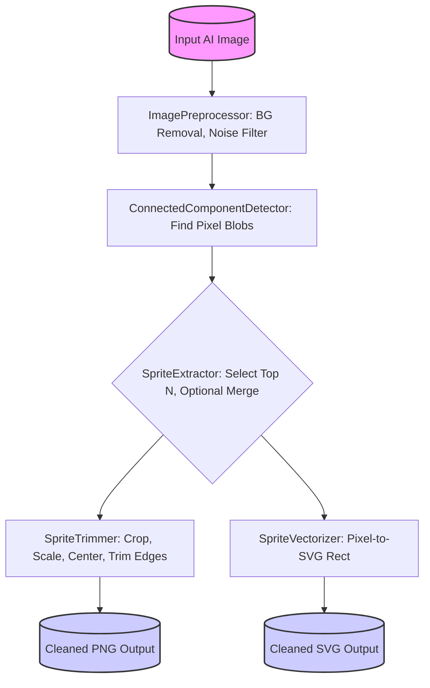

# Java Library for Pixel‑Art Extraction & Vectorization

A lightweight Java library designed to process pixel art sprite assets, particularly those generated by Large Language
Models (LLMs) or other AI image generation tools, making them clean, standardized, and ready for use in game development
or other applications.

This library automatically cleans up common issues found in AI-generated pixel art, such as noisy backgrounds,
inconsistent sizing, extraneous pixels, and non-uniform transparency. It extracts distinct sprites, trims them
precisely, scales them uniformly using pixel-perfect methods, and exports them in game-ready formats like PNG and
resolution-independent SVG.

## Key Features

* **Preprocessing:** Automatic background estimation and removal using OpenCV's HSV flood-fill, with optional noise
  filtering to clean up raw generated images.
* **Connected-Component Labeling:** Uses a fast Breadth-First Search (BFS, 4-way connectivity) to identify distinct
  sprite regions within the image, even amidst noise.
* **Sprite Extraction:** Isolates and keeps the N largest components (potential sprites). Optionally, it can merge small
  leftover fragments into the nearest main sprite, consolidating messy generations.
* **Trimming & Standardization:** Standardizes sprites by cropping them to their precise bounding box, scaling them to a
  target size using nearest-neighbor sampling, centering them based on their center-of-mass, removing edge fuzz (
  near-transparent pixels), and applying alpha solidification to prevent color bleeding during scaling or rendering.
* **Vectorization:** Generates pixel-perfect SVG output ensuring crisp, resolution-independent vector assets derived
  from the pixel data.
* **Rich Configuration:** Fine-tune the cleaning and standardization process using `PixelatorConfig` – adjust
  thresholds, select output formats, control scaling, trimming behavior, and more.

## Getting Started

### Requirements

| Tool           | Version Requirement | Notes                                                                                 |
|:---------------|:--------------------|:--------------------------------------------------------------------------------------|
| JDK            | 17 or later         |                                                                                       |
| Maven          | 3.9+                | Needed for building the library or if using it in a Maven project.                    |
| OpenCV JavaCPP | 1.5+                | Required for image processing functions. Declared as a Maven dependency in `pom.xml`. |

**Tip:** The necessary OpenCV JavaCPP presets can be pulled directly from Maven Central via the `pom.xml` dependencies.

### Embedding as a Library

Add the library as a dependency to your project:

**Maven:**

```xml

<dependency>
    <groupId>io.github.jakepalanca</groupId>
    <artifactId>image-pixelator</artifactId>
    <version>1.0.0</version>
</dependency>
```

## Example Usage

```java
import com.example.pixelator.PixelatorConfig; // ## <-- Adjust import path if needed
import com.example.pixelator.PixelatorService; // ## <-- Adjust import path if needed

import java.nio.file.Paths;
import java.nio.file.Path;

public class PixelArtProcessorExample {
    public static void main(String[] args) {
        // Configure the processing
        PixelatorConfig config = new PixelatorConfig();
        config.setTopNSprites(1); // Often only want the single primary sprite from an AI generation
        config.setTargetWidth(32); // Target size for game asset
        config.setTargetHeight(32);
        config.setEnableLeftoverMerge(true); // Merge stray pixels into the main sprite
        config.setEnableEdgeTrim(true);     // Clean up fuzzy edges common in AI outputs
        config.setAlphaCutoff(100);         // Define what alpha level is considered transparent
        config.setMinNoiseSize(5);          // Remove very small, isolated pixel groups

        // Create the service and process an image
        PixelatorService service = new PixelatorService(config);
        Path inputFile = Paths.get("path/to/your/ai_generated/sprite_raw.png");
        Path outputDir = Paths.get("path/to/your/processed_assets/"); // Directory to save results

        try {
            // The service will create a subdirectory within outputDir named after the input file
            // e.g., outputDir/sprite_raw.png_output/sprite_1.png
            service.processImage(inputFile, outputDir);
            System.out.println("AI sprite processed successfully!");

            // Example: Accessing the primary output file path (assuming topNSprites=1)
            String outputSubDirName = inputFile.getFileName().toString() + "_output";
            Path mainSpritePng = outputDir.resolve(outputSubDirName).resolve("sprite_1.png");
            Path mainSpriteSvg = outputDir.resolve(outputSubDirName).resolve("sprite_1.svg");
            System.out.println("Cleaned PNG saved to: " + mainSpritePng);
            System.out.println("Cleaned SVG saved to: " + mainSpriteSvg);

        } catch (Exception e) {
            System.err.println("Error processing image: " + e.getMessage());
            e.printStackTrace();
        }
    }
}
```

---

## Configuration Cheat-Sheet

You can customize the behavior using `PixelatorConfig`. Here are some key parameters relevant for cleaning AI-generated
sprites:

| Configuration Parameter | Default Value | Description                                                                                        | Setter Method            |
|-------------------------|---------------|----------------------------------------------------------------------------------------------------|--------------------------|
| Top N Sprites           | 4             | Number of the largest distinct pixel groups (sprites) to keep. Set to 1 for single sprites.        | `setTopNSprites`         |
| Target Width            | 64            | The width (in pixels) to scale the final sprite to.                                                | `setTargetWidth`         |
| Target Height           | 64            | The height (in pixels) to scale the final sprite to.                                               | `setTargetHeight`        |
| Enable Leftover Merge   | false         | If true, merges tiny leftover pixel groups into the nearest main sprite. Useful for consolidation. | `setEnableLeftoverMerge` |
| Enable Edge Trim        | false         | If true, removes near-white or near-transparent 'fuzz' pixels from the sprite border.              | `setEnableEdgeTrim`      |
| Alpha Cutoff            | 120           | Alpha channel value threshold. Pixels below are treated as fully transparent during processing.    | `setAlphaCutoff`         |
| Min Noise Size          | 0             | Connected pixel groups with an area smaller than this are deleted as noise early on.               | `setMinNoiseSize`        |

> For the full list of configuration options, please refer to the `PixelatorConfig.java` source file.

---

## Processing Pipeline

The processing follows this flow internally:



---

## License

This project is licensed under the **MIT License**.

MIT © 2025 Jake Palanca
