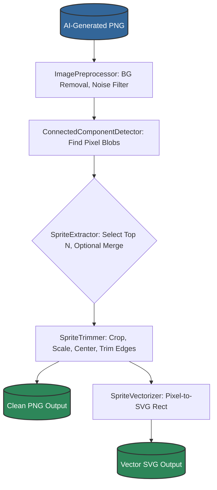

# PngToVectConverter

A specialized Java library designed to transform PNG images that mimic pixel art (particularly those created by Large Language
Models like GPT-4, DALL-E, Midjourney, or other AI tools) into clean, game-ready vector graphics.

## 🎯 Purpose

The library solves a specific challenge: LLMs can generate low-resolution pixel art, but these outputs typically contain 
artifacts, inconsistent edges, transparency issues, and other imperfections that make them unsuitable for direct use in 
games or applications. PngToVectConverter automatically:

1. **Cleans AI-generated noise** from what should be crisp pixel art
2. **Extracts distinct sprites** from cluttered backgrounds
3. **Produces crisp SVG vectors** that preserve the pixel-perfect look at any resolution

## 🧹 Problems It Solves

When LLMs generate "pixel art" they often produce:
- Noisy backgrounds with nearly-transparent pixels
- Blurry or anti-aliased edges where crisp boundaries are needed
- Multiple sprites merged in a single image without clear separation
- Inconsistent scaling and dimensions

This library automatically identifies and fixes these issues to produce clean, usable vector assets.

## Key Features

* **LLM Output Cleaning:** Specialized preprocessing to handle the unique artifacts produced by AI image generators attempting to create pixel art
* **Connected-Component Labeling:** Uses fast BFS algorithms to identify and separate distinct sprite regions
* **Smart Sprite Extraction:** Isolates multiple sprites from a single image, even when poorly segmented by the AI
* **Pixel-Perfect Vectorization:** Generates SVG files with precise rectangular elements that maintain the authentic pixel-art look at any scale
* **Flexible Configuration:** Fine-tune the cleaning process with `PixelatorConfig` to handle various AI generation quirks

## Getting Started

### Requirements

| Tool           | Version Requirement | Notes                                                                                 |
|:---------------|:--------------------|:--------------------------------------------------------------------------------------|
| JDK            | 17 or later         |                                                                                       |
| Maven          | 3.9+                | Needed for building the library or if using it in a Maven project.                    |
| OpenCV JavaCPP | 1.5+                | Required for image processing functions. Declared as a Maven dependency in `pom.xml`. |

### Embedding as a Library

Add the library as a dependency to your project:

**Maven:**

```xml
<dependency>
    <groupId>io.github.jakepalanca</groupId>
    <artifactId>png-to-vect-converter</artifactId>
    <version>1.0.0</version>
</dependency>
```

## Example Usage

```java
import PngToVectConverter.Pixelator;

import java.nio.file.Paths;
import java.io.IOException;

public class PngToVectExample {
    public static void main(String[] args) throws IOException {
        // Convert LLM-generated pixel art to clean vector files
        Pixelator.builder()
                .userId("user123")
                .minNoise(5)         // Remove small pixel artifacts
                .size(64, 64)        // Standardize to game-friendly dimensions
                .topSprites(4)       // Extract up to 4 distinct sprites 
                .formats("png", "svg") // Output both PNG and vector SVG
                .processImage(Paths.get("llm_pixel_art.png"), Paths.get("game_assets"));
                
        // Or as a one-liner with default settings:
        // Pixelator.process(Paths.get("llm_pixel_art.png"), Paths.get("game_assets"));
    }
}
```

---

## Configuration Cheat-Sheet

You can customize the behavior using `PixelatorConfig`. Here are some key parameters:

| Configuration Parameter | Default Value | Description                                                                                        | Setter Method            |
|-------------------------|---------------|----------------------------------------------------------------------------------------------------|--------------------------|
| Top N Sprites           | 4             | Number of the largest distinct pixel groups (sprites) to extract from the AI-generated image       | `setTopNSprites`         |
| Target Width            | 64            | The width (in pixels) to scale the final sprite to                                                | `setTargetWidth`         |
| Target Height           | 64            | The height (in pixels) to scale the final sprite to                                               | `setTargetHeight`        |
| Enable Leftover Merge   | false         | If true, merges tiny leftover pixel groups into the nearest main sprite (fixes fragmented AI output) | `setEnableLeftoverMerge` |
| Enable Edge Trim        | false         | If true, removes near-white or near-transparent 'fuzz' pixels common in AI-generated content      | `setEnableEdgeTrim`      |
| Alpha Cutoff            | 120           | Alpha channel value threshold to clean up semi-transparent areas from AI generators               | `setAlphaCutoff`         |
| Min Noise Size          | 0             | Pixel groups smaller than this are deleted as AI-generated noise                                  | `setMinNoiseSize`        |

> For the full list of configuration options, please refer to the `PixelatorConfig.java` source file.

---

## Processing Pipeline

The processing follows this flow internally:



---

## License

This project is licensed under the **MIT License**.

MIT © 2025 Jake Palanca
